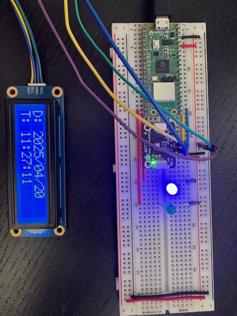
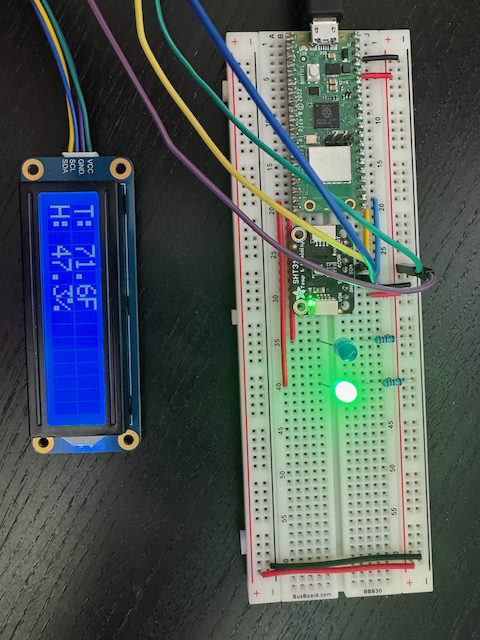

# MicroPython
Helpful stuff for MicroPython projects

## Driver for LCD 1602

`lcd1602.py` contains the class `LCD1602` for communicating with a Waveshare (or equivalent) 1602 LCD module over `I2C`.

## Driver for SHT 31

`sht31.py` contains the class `SHT31` for communicating with an SHT 31 module over `I2C`.

## Client for NTP

`ntp.py` contains the class `Client` for obtaining current time using the `NTP` protocol.

See this [Wikipedia Article](https://en.wikipedia.org/wiki/Network_Time_Protocol) for details.

## Demo

`demo.py` contains a demo script that obtains current date/time from an NTP server and displays that along with current temperature and relative humidity. The demo, therfore, requires a board with network capabilities.

The code is somewhat configurable via a `settings.json` file that must be copied to the onboard flash storage. The `I2C` pins and the pins connected to the two LEDs can be easily changed in the code to match your setup.

### settings.json:

    {
        "wlan": {
            "ssid": "<WI-FI SSID>",
            "key": "<WI-FI KEY>"
        },
        "ntp": {
            "host": "time.apple.com",
            "port": 123,
            "interval": 3600,
            "offset": -4
        },
        "sht31": {
            "unit": "F"
        },
        "app": {
            "loops": 100,
            "delay": 5000
        }
    }

#### `wlan` section

- `ssid` should be set to your Wi-Fi router's SSID.
- `key` should be set to your Wi-Fi router's key.

#### `ntp` section

- `host` should be set to an `NTP` server's host name or IP address.
- `port` should set to the `NTP` server's port. This is almost always `123` but may differ for e.g., local, self-hosted time servers.
- `interval` should be set to the number of seconds between time being synchronized to the board's `RTC` instance.
- `offset` should be set to the number of hours east (positive) or west (negative) of UTC. E.g., Eastern Daylight Savings Time (EDT) is 4 hours west, so `-4`.

#### `sht31` section

- `unit` defaults to `F` for Fahrenheit but can be set to `C` for Celcius.

#### `app` section

- `loops` should be set to the number of loops the application will make before exiting.
- `delay` should be set to the number of milliseconds to delay between switching between date/time and temp/humidity.

### Setup

The demo setup depicted below is a Pi Pico W running MicroPython 1.25.0. It is recommended to use `mpremote` to set up the flash filesystem with the libraries and the `settings.json` file.

1. `mpremote fs mkdir :lib`
2. `mpremote fs cp lcd1602.py :lib/lcd1602.py`
3. `mpremote fs cp sht31.py :lib/sht31.py`
4. `mpremote fs cp ntp.py :lib/ntp.py`
5. `mpremote fs cp settings.json :settings.json`

__Please note__: The library modules can be pre-compiled before copying using the `mpy-cross` tool.

1. `mpy-cross -march=armv6m lcd1602.py`
2. `mpremote fs cp lcd1602.mpy :lib/lcd1602.mpy`
3. `mpy-cross -march=armv6m sht31.py`
4. `mpremote fs cp sht31.mpy :lib/sht31.mpy`
5. `mpy-cross -march=armv6m ntp.py`
6. `mpremote fs cp ntp.mpy :lib/ntp.mpy`

__Please note__: Make sure you specify the correct architecture for your board. The Pi Pico W is `armv6m`.

As can be seen from the code in `demo.py`, the blue LED is connected to GPIO pin `15` and the green LED is connected to GPIO pin `14`. The two LEDs are connected using the two red wires on the breadboard. Both LEDs are connected to ground through a current-limiting resistor. The `I2C` bus is configured with `SCL` on pin `17` and `SDA` on pin `16`. The `I2C` bus is the blue wire (`SCL`) and the yellow wire (`SDA`). Both the `SHT 31` module and `LCD 1602` module `SCL` and `SDA` lines are connected to these wires. The board's power (`VCC`) and ground (`GND`) are connected to the breadboard's power rail which, in turn, powers both modules. The `LCD 1602` module uses green for `VCC` and purple for `GND`. The blue LED is lit when the display is showing date and time; the green LED is lit when the display is temperature and humidity.

To run the demo, run `mpremote run demo.py`